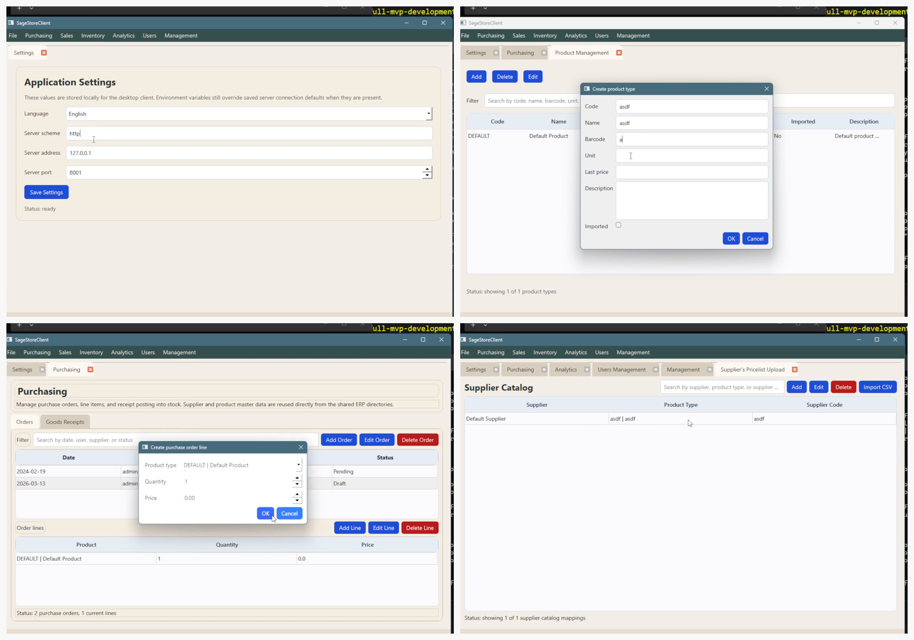
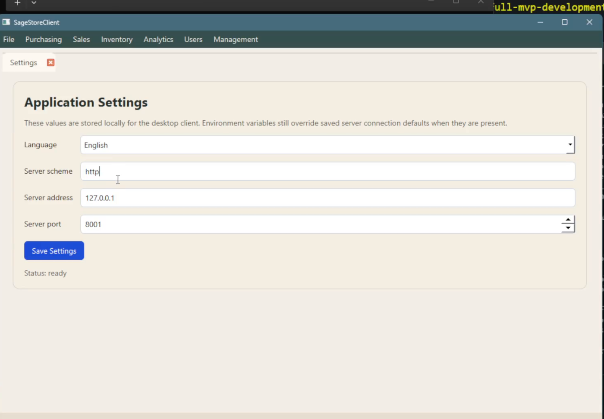
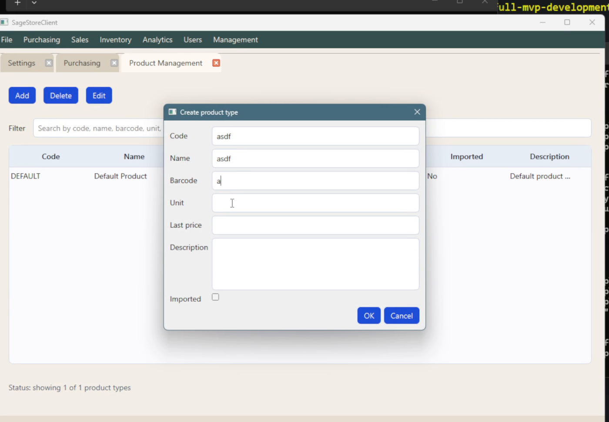
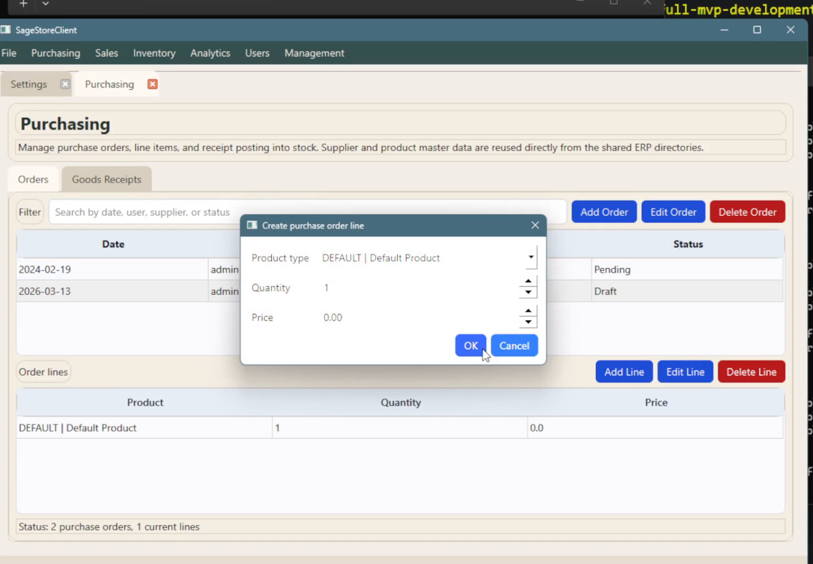
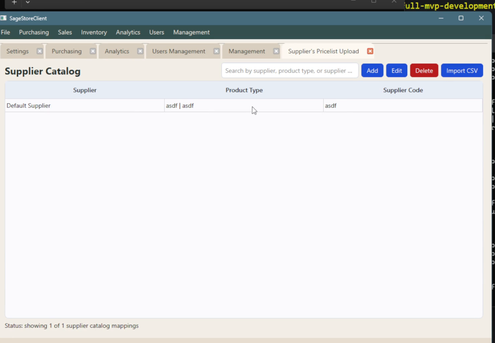

# SageStore

SageStore is a desktop business-operations MVP for small goods-selling operations. It combines a Qt client, a consumer-agnostic HTTP server, and SQLite persistence to support everyday workflows across inventory, purchasing, sales, access control, analytics, and audit visibility.

**Current stage:** validated MVP baseline, not yet a packaged production release or a feature-complete business suite.

<p align="center">
  
</p>

<p align="center">
  <em>Actual screenshots extracted from the current local product demo.</em>
</p>

## Why SageStore

SageStore is designed around a practical split between operator workflow and business logic:

- A Qt desktop workspace for day-to-day operations
- A stable HTTP API that is not tied only to the current desktop client
- Shared contracts in `_common/` so client and server evolve together
- SQLite-backed repositories behind business modules

That keeps the current desktop product usable while preserving a clean path for future web, mobile, CLI, or integration consumers.

## What Works Today

- Login, user administration, and role administration
- Product type CRUD and stock tracking
- Supplier catalog mappings with desktop CSV import
- Purchase orders, line items, and goods receipt posting into stock
- Sales orders with basic invoice export
- Contacts/customers, suppliers, and employees CRUD
- Audit log browsing and summary analytics
- English and Ukrainian language selection in desktop settings

## Product Demo

<table>
  <tr>
    <td width="50%">
      
      <br>
      <strong>Configure the client once</strong>
      <br>
      Operators can save connection defaults and choose the desktop UI language between English and Ukrainian.
    </td>
    <td width="50%">
      
      <br>
      <strong>Maintain product master data</strong>
      <br>
      Product types carry the identifiers the rest of the application relies on, including code, barcode, unit, description, and pricing fields.
    </td>
  </tr>
  <tr>
    <td width="50%">
      
      <br>
      <strong>Process purchasing workflows</strong>
      <br>
      Buyers can create purchase orders, add line items, and move received goods into tracked stock.
    </td>
    <td width="50%">
      
      <br>
      <strong>Normalize supplier data</strong>
      <br>
      Supplier product codes can be mapped back to internal product types, including CSV-driven import workflows for catalog maintenance.
    </td>
  </tr>
</table>

## Why This Repo Is Credible

- The implemented slices are not mockups. They are wired across `_client/`, `_server/`, and `_common/`.
- The repo contains unit, component, contract, and Qt UI tests.
- Validation flows already include build/test automation, smoke checks, documentation generation, and markdown link checking.
- Jenkins is present for dependency installation, docs link validation, build, and test execution.

For the current evidence-based status, see [docs/Implementation_Status.md](docs/Implementation_Status.md) and [docs/Requirements_Baseline.md](docs/Requirements_Baseline.md).

## Current Limits

SageStore is intentionally presented as an implemented MVP baseline, not as a finished all-in-one business product.

The following broader product goals are still incomplete or only partially realized:

- companies support
- barcode label generation and printing
- incoming invoice upload/attachment workflows
- richer packaging and installer automation
- live language hot-swap without restart
- broader export/reporting depth beyond the current baseline

## Quick Start

Build everything:

```bash
python3 build.py all
```

Run tests:

```bash
python3 build.py test
```

Run the current full stack from WSL2/WSLg:

```bash
scripts/wsl/run_fullstack_gui.sh
```

## Build, Run, and Docs

Recommended scripted commands:

```bash
python3 build.py client
python3 build.py server
python3 build.py tests
python3 build.py test
python3 build.py smoke
python3 build.py smoke-gui
python3 build.py docs
python3 build.py clean
```

Manual build:

```bash
conan install . --output-folder=build --build=missing
cmake -S . -B build -G Ninja -DCMAKE_TOOLCHAIN_FILE=build/conan_toolchain.cmake -DCMAKE_POLICY_DEFAULT_CMP0091=NEW -DCMAKE_BUILD_TYPE=Release -DBUILD_CLIENT=ON -DBUILD_SERVER=ON -DBUILD_TESTS=ON
cmake --build build --parallel
```

Manual run:

```bash
./build/_server/SageStoreServer
./build/_client/SageStoreClient
```

Useful documentation entry points:

- [docs/Implementation_Status.md](docs/Implementation_Status.md)
- [docs/Requirements_Baseline.md](docs/Requirements_Baseline.md)
- [docs/Deployment_Runbook.md](docs/Deployment_Runbook.md)
- [docs/architecture/](docs/architecture/)
- [docs/client/](docs/client/)
- [docs/server/](docs/server/)

Markdown link validation:

```bash
python3 scripts/check_docs_links.py
```

## Contributing

See [CONTRIBUTING.md](CONTRIBUTING.md).

## License

GPL v3. See [LICENSE](LICENSE).
