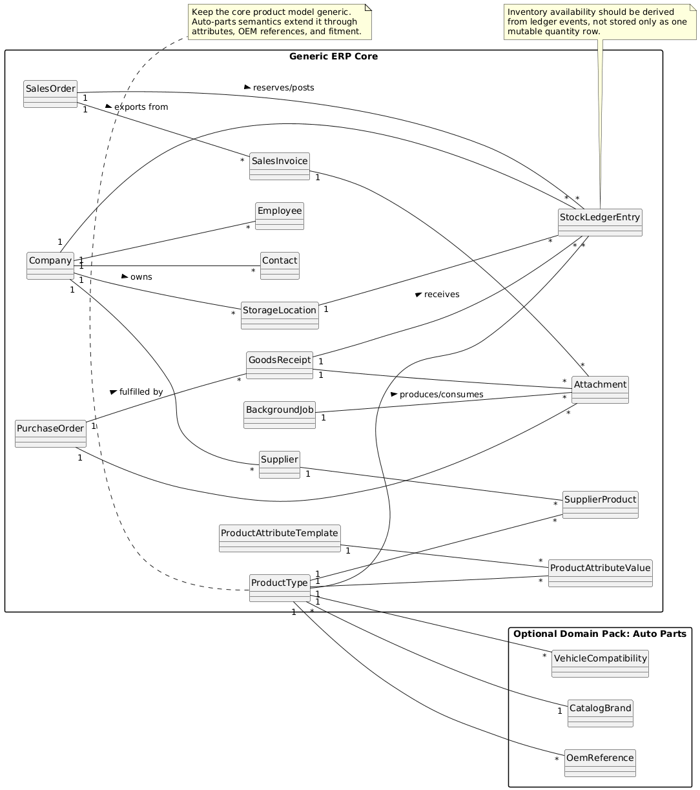
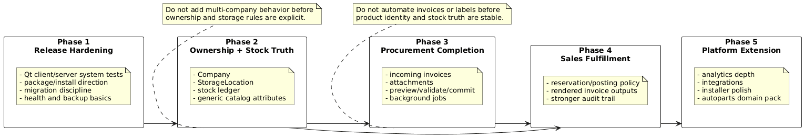
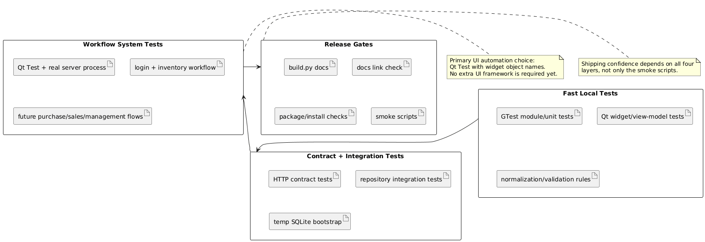

# SageStore ERP Readiness Assessment

## 0. Executive mental model

- SageStore is already a credible modular-monolith ERP MVP: real desktop UI, real HTTP API, real SQLite persistence, and real tests across `_client/`, `_server/`, and `_common/`. [Code]
- It is not yet ready to be installed as a production ERP for a generic store because five foundations are still incomplete: ownership/storage modeling, stock-truth semantics, document/attachment workflows, release/operability, and full workflow validation breadth. [Code] [Risk]
- The current strongest slice is inventory master data plus procurement receipt posting. The weakest production foundations are multi-company storage, sales fulfillment semantics, incoming-document processing, and release packaging/migrations. [Code]
- Autoparts should be treated as a domain pack on top of generic store primitives. The core model must stay generic; autoparts-specific fields belong in optional classification, attributes, and compatibility relations rather than in hard-coded core entities. [Inference]
- The fastest honest improvement is not a rewrite. It is: tighten workflow contracts, add missing domain seams, increase real client/server system coverage, and package the current baseline safely. [Code] [Risk]
- This pass adds a small Qt-driven live workflow suite for inventory CRUD, management contact creation, purchase receipt posting, sales invoice preview/export, and broad workspace loading, which closes the most immediate testing credibility gap without introducing a new UI framework. [Code]

PlantUML source: [ERP target domain model](architecture/plantuml/ERP_Target_Domain_Model.puml)

## 1. Topic tree

- Product readiness
  - release/installability
  - migrations/operability
  - validation gates
- Core ERP domain
  - parties and ownership
  - catalog and inventory truth
  - purchase/receipt lifecycle
  - sales/invoice lifecycle
- Store extensibility
  - generic store baseline
  - autoparts specialization
- Quality system
  - unit/repository/contract/UI tests
  - fullstack GUI/system tests
  - smoke/docs/release gates

## 2. Terms you must know first

- `Master data`: durable business entities such as products, suppliers, contacts, companies, and storages. These must stabilize before automation is safe. [Spec]
- `Stock truth`: the authoritative explanation of why quantity changed, not only the latest count. A stock ledger is stronger than a single mutable quantity row. [Inference]
- `Document lifecycle`: the allowed transitions and side effects for a business document such as purchase order, goods receipt, sales order, or invoice. [Spec]
- `Attachment pipeline`: file-oriented flow for upload, validation, preview, commit, and audit of invoices, imports, and exports. [Spec]
- `Background job`: an observable long-running task for imports, exports, label generation, or reconciliations. The current repo does not have this layer yet. [Code]
- `System test`: a test that drives real UI widgets against a real server process and real database bootstrap, not only mocks. [Code]
- `Autoparts extension`: optional catalog semantics such as manufacturer/OEM numbers, fitment compatibility, and brand metadata that should extend the generic product model rather than replace it. [Inference]

## 3. User / operator / OEM / ISP perspective

- A generic store operator needs trustworthy catalog data, scoped stock ownership, purchase receiving, sales fulfillment, exports, audit history, and a release that installs and upgrades predictably. [Spec]
- An autoparts store adds domain-specific catalog pressure: multiple supplier codes, OEM/manufacturer numbers, compatibility lookups, and richer search. Those are extensions to the catalog, not reasons to specialize the entire ERP core. [Inference]
- A deployer or maintainer needs repeatable package/install steps, database migration discipline, backup/restore guidance, and health/status checks. The current repo does not provide that yet. [Code]
- A future non-Qt consumer needs the HTTP surface to stay resource-oriented and consumer-agnostic. The current endpoint split already points in the right direction. [Code]

## 4. Specification perspective

- The target/reference scope in [Project_Documentation](Project_Documentation.md) expects companies, company-scoped storage, barcode/label generation, incoming invoices, richer invoice export, and broader document automation. [Spec]
- The forward roadmap in [Future_Architecture_and_Design_Roadmap](Future_Architecture_and_Design_Roadmap.md) correctly says the next honest steps are baseline hardening, master-data ownership, procurement ingestion, then sales fulfillment and outputs. [Spec]
- The repo’s own [Requirements_Baseline](Requirements_Baseline.md) already documents that current scope is narrower than target scope and that future work must remain contract-first and modular-monolith-first. [Spec]
- The deployment truth in [Deployment_Runbook](Deployment_Runbook.md) still says there is no installer bundle, no publish stage, and no migration/backup discipline, even though a basic health probe now exists. [Spec]

## 5. Current implementation perspective

| Area | What the code proves today | Key evidence |
| --- | --- | --- |
| API/module split | Real modules for users, system, inventory, management, purchase, sales, logs, and analytics | [BusinessLogic.cpp](../_server/src/BusinessLogic/BusinessLogic.cpp), [Endpoints.hpp](../_common/include/common/Endpoints.hpp) |
| Inventory baseline | ProductType CRUD, stock CRUD, supplier-product mappings, purchase receipts posting into inventory | [InventoryModule.cpp](../_server/src/BusinessLogic/InventoryModule.cpp), [PurchaseModule.cpp](../_server/src/BusinessLogic/PurchaseModule.cpp) |
| Sales baseline | Sales orders and line items exist, but sales do not update inventory | [SalesModule.cpp](../_server/src/BusinessLogic/SalesModule.cpp) |
| Schema baseline | Current schema has users, roles, contacts, employees, suppliers, products, inventory, sales, purchases, and logs | [create_db.sql](../scripts/create_db.sql) |
| Operability baseline | A neutral `/api/system/health` endpoint exists for readiness checks and harness startup | [Endpoints.hpp](../_common/include/common/Endpoints.hpp), [SystemModule.cpp](../_server/src/BusinessLogic/SystemModule.cpp) |
| Audit baseline | Mutations create coarse audit entries with `userId`, `action`, and `timestamp` | [BusinessLogic.cpp](../_server/src/BusinessLogic/BusinessLogic.cpp), [LogsModule.cpp](../_server/src/BusinessLogic/LogsModule.cpp) |
| Test baseline | Good unit, repository integration, HTTP contract, Qt widget, smoke, and docs-link coverage already exists, and live Qt workflow coverage now spans inventory CRUD, management contact creation, purchase receipt posting, sales invoice preview/export, and workspace loading | `_server/tests/**`, `_client/tests/unit/**`, `_client/tests/component/**`, `_client/tests/integration/**`, `_client/tests/system/**`, [build.py](../build.py), [Jenkinsfile](../Jenkinsfile) |
| New in this pass | Live Qt widget workflows now run against a real server process across inventory, management, purchase, and sales slices | [FullstackInventoryWorkflowTest.cpp](../_client/tests/system/FullstackInventoryWorkflowTest.cpp), [FullstackMainWindowWorkflowTest.cpp](../_client/tests/component/FullstackMainWindowWorkflowTest.cpp), [FullstackWorkflowTest.cpp](../_client/tests/integration/FullstackWorkflowTest.cpp), [FullstackSalesInvoiceExportTest.cpp](../_client/tests/component/FullstackSalesInvoiceExportTest.cpp) |

## 6. Spec vs implementation gap

| Gap cluster | Current state | Why it blocks ERP readiness | Target design | Dependency order |
| --- | --- | --- | --- | --- |
| Ownership and storage model | No `Company` entity, no `StorageLocation`, `Inventory` is unique by `productTypeId`, and `employeeId` acts like last handler metadata rather than ownership scope. [Code] | The system cannot explain which company owns stock, where stock lives, or how a multi-branch store should separate operational truth. [Risk] | Add `Company`, `StorageLocation`, company-scoped parties, and company/storage-aware stock queries. Keep shared/global masters explicit. [Inference] | Before multi-company, before invoice automation |
| Stock truth model | Inventory is a mutable `quantityAvailable` row; purchase receipts add quantity; sales do not reserve or decrement; no ledger or adjustment entities exist. [Code] | ERP inventory must explain movement causes, reversals, corrections, and reservations. A single mutable row is too weak for production auditability. [Risk] | Introduce `StockLedgerEntry` plus derived availability views; formalize receipt, adjustment, transfer, reservation, and sales-posting commands. [Inference] | After ownership/storage model |
| Document lifecycle and attachments | Purchase has orders, lines, and receipt posting, but no incoming invoice entity, attachment storage, staged validation, or jobs. [Code] | Procurement evidence still depends on out-of-band files and manual reconciliation. That breaks traceability and operational completeness. [Risk] | Add document/attachment services, staged import pipeline, and observable jobs for invoice ingestion and supplier catalog processing. [Inference] | After stable master data and stock truth |
| Generic catalog extensibility | `ProductType` only carries code, barcode, name, description, last price, unit, and imported flag. No category, brand, tax, packaging, or generic attribute system exists; no autoparts fitment model exists. [Code] | A generic store ERP needs configurable catalog semantics, and autoparts need compatibility data. Hard-coding autoparts into the core would damage reuse. [Risk] | Keep `ProductType` core generic, add attribute templates/values and optional domain extension tables such as `VehicleCompatibility`, OEM numbers, and brand metadata. [Inference] | In parallel with phase-2 master-data work |
| Sales fulfillment and document outputs | Sales orders/lines exist and invoice preview/export is only simple text from the desktop. No stock-posting policy, no printable/rendered outputs, and no explicit invoice lifecycle beyond status strings. [Code] | Sales is administratively present but not operationally complete. Store installs need a deliberate posting/export policy. [Risk] | Add explicit sales lifecycle, reservation/posting policy, HTML/PDF renderers, and export audit trail before external XML integrations. [Inference] | After procurement/document foundations |
| Release and operability | `build.py`, `Jenkinsfile`, and [Deployment_Runbook](Deployment_Runbook.md) still describe build/test/archive, not install/upgrade/package. A basic `/api/system/health` probe now exists, but there is still no migration runner, backup/restore path, or installer workflow. [Code] | A system is not install-ready if it cannot be packaged, upgraded, diagnosed, and recovered predictably. [Risk] | Add schema migration discipline, installer/package definition, packaged-runtime smoke, backup/restore docs, and release gates. [Inference] | Starts immediately, continues through all phases |
| Validation breadth | Existing tests are strong for units/contracts and mocked Qt workflows, and the repo now has live client/server tests for inventory CRUD, management contact creation, purchase receipt posting, sales invoice preview/export, and workspace loading, but auth-failure, CRUD-heavy admin flows, sales posting/cancel, and installed-package workflows are still missing. [Code] | Production ERP confidence comes from workflow-level validation, not only unit and mock-driven tests. [Risk] | Expand Qt system tests by workflow slice, keep contract tests for API truth, and preserve smoke/docs/package gates. [Inference] | Starts immediately |

PlantUML source: [ERP phased delivery dependencies](architecture/plantuml/ERP_Phased_Delivery_Dependencies.puml)

### Phase plan

| Phase | Primary outcome | Dependencies satisfied | Exit signal |
| --- | --- | --- | --- |
| Phase 1: release hardening | Real client/server system tests, package strategy, migration policy, health checks, backup/restore runbook | none | The current baseline is shippable and diagnosable |
| Phase 2: ownership and stock truth | `Company`, `StorageLocation`, stock ledger, scoped master data, generic catalog attributes | phase 1 | Inventory state is explainable across companies/storages |
| Phase 3: procurement completion | incoming invoices, attachments, validation/preview/commit pipeline, background jobs | phase 2 | Receiving no longer depends on manual side channels |
| Phase 4: sales fulfillment | reservation/posting policy, invoice rendering/export pipeline, stronger audit | phases 2-3 | Sales affects inventory and documents consistently |
| Phase 5: platform extension | richer analytics, integrations, installer polish, upgrade tooling, domain packs such as autoparts compatibility | phases 1-4 | New store verticals extend stable contracts instead of changing the core |

### Autoparts-with-generic-store rule

- Keep the ERP core generic: parties, catalog, stock, purchasing, sales, documents, jobs. [Inference]
- Add autoparts as optional extension tables and search behavior: manufacturer part numbers, OEM codes, compatibility, brand, and supplier cross-reference data. [Inference]
- Do not add vehicle-specific assumptions to purchase, sales, or stock modules. Those modules should consume generic product identifiers plus optional extension metadata. [Risk]

## 7. Major issues and future traps

- Multi-company must not be bolted onto the current `Inventory` table shape without deciding whether stock is company-scoped, storage-scoped, or both. [Risk]
- Sales stock posting must not be added as an incidental UI side effect. It needs an explicit policy and server-side command path. [Risk]
- Incoming invoices and label generation must not be implemented before the product identity model is stable, or the repo will accumulate brittle import heuristics. [Risk]
- Packaging without migrations and backup/restore guidance would create an installable but unsafe product. [Risk]
- Autoparts pressure can easily distort the core architecture. The safe design is generic catalog plus domain pack, not a vehicle-centric rewrite. [Risk]

## 8. Hands-on verification path

1. Build and run all tests:
   - `python3 build.py tests`
   - `python3 build.py test`
2. Run docs validation and diagram render:
   - `python3 scripts/check_docs_links.py`
   - `python3 build.py docs`
3. Confirm the live workflow suite exists in `ctest` output:
   - `curl http://127.0.0.1:8001/api/system/health`
   - `ctest --test-dir build -N`
   - `ctest --test-dir build --output-on-failure --verbose -R "Fullstack"`
4. Smoke the built binaries:
   - `python3 build.py smoke`
   - `python3 build.py smoke-gui`
5. Reconcile status docs after any scope change:
   - [Implementation_Status](Implementation_Status.md)
   - [Deployment_Runbook](Deployment_Runbook.md)
   - [ERP_Testing_Strategy](ERP_Testing_Strategy.md)

PlantUML source: [ERP test architecture](architecture/plantuml/ERP_Test_Architecture.puml)

## 9. Self-test

- Can the current schema explain which company owns a stock record? If not, phase 2 is still incomplete.
- Can the current system explain why stock changed, not only the latest quantity? If not, stock truth is still incomplete.
- Can an incoming supplier invoice be attached, validated, previewed, committed, and audited? If not, procurement is still incomplete.
- Can a sales document reserve or post stock through a deliberate server-side lifecycle? If not, sales is still incomplete.
- Can the product be installed, upgraded, and recovered with documented steps? If not, release readiness is still incomplete.
- Do workflow-level tests exist for users, inventory, management, purchase, and sales against a real server, including failure and posting paths? If not, validation breadth is still incomplete.

## 10. Next branches to study

- [ERP testing strategy](ERP_Testing_Strategy.md)
- [Implementation status](Implementation_Status.md)
- [Future architecture and design roadmap](Future_Architecture_and_Design_Roadmap.md)
- [Deployment runbook](Deployment_Runbook.md)
- [Project documentation target scope](Project_Documentation.md)
