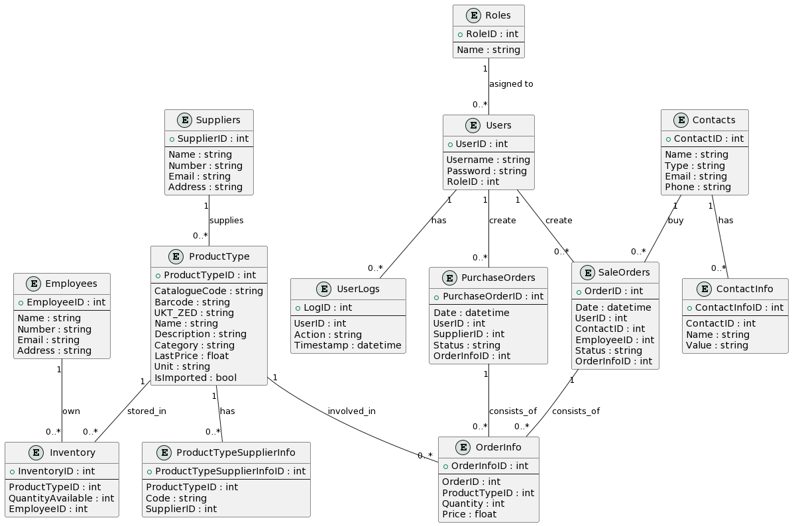
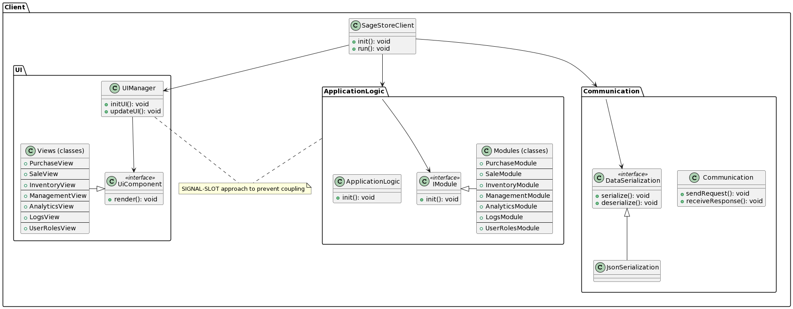

# SageStore

## Comprehensive Documentation for Design, Development, and Deployment Phases

- **Prepared by:** Volodymyr Pavlenko
- **Date:** October 10, 2023
- **Version:** 2.0

---

## Table of Contents

1. [Confidentiality Notice](#confidentiality-notice)
2. [Project Overview](#project-overview)
3. [Project Time Borders](#project-time-borders)
4. [Project Objectives](#project-objectives)
5. [Timeline and Milestones](#timeline-and-milestones)
6. [Feature Breakdown](#feature-breakdown)
7. [User Stories](#user-stories)
8. [Tech Stack](#tech-stack)
9. [Database](#database)
10. [Architecture Design](#architecture-design)
    - [Client Design](#client-design)
    - [Server Design](#server-design)
    - [REST API](#rest-api)
11. [Practices and Methodologies](#practices-and-methodologies)
12. [Development Phase](#development-phase)
13. [Deployment Phase](#deployment-phase)
14. [Post-launch](#post-launch)
15. [Executive Summary](#executive-summary)
16. [Risk Management](#risk-management)
17. [Quality Assurance Plans](#quality-assurance-plans)
18. [Compliance and Regulations](#compliance-and-regulations)
19. [Document Versioning](#document-versioning)

---

## Project Overview

The ERP system aims to offer a comprehensive solution for managing the core business processes of a small-to-medium enterprise (SME). The system will be a client-server desktop application developed using C++20 and Qt 6.5.

---

## Project Time Borders

| Event         | Date              |
| ------------- | ----------------- |
| Project Start | October 1, 2023   |
| Project End   | December 31, 2023 |

---

## Project Objectives

| Objective                  | Description                                                |
| -------------------------- | ---------------------------------------------------------- |
| Efficient Sales Management | Handle different types of sales documentation efficiently. |
| Inventory Control          | Effective tracking and auditing of inventory.              |
| Scalable Analytics         | Analytics on sales, inventory, and employee performance.   |
| User-Friendly              | Intuitive UI and easy-to-use features.                     |

---

## Timeline and Milestones

| Milestone                                | Deadline          | Deliverable                                      |
| ---------------------------------------- | ----------------- | ------------------------------------------------ |
| Requirement Analysis and Planning        | October 18, 2023  | Detailed requirements and planning documents     |
| Database Schema Design                   | October 20, 2023  | Database Schema and Entity-Relationship Diagrams |
| Frontend Development (Basic Features)    | October 28, 2023  | Completed UI for Basic Features                  |
| Backend Development (Basic Features)     | November 7, 2023  | Working Backend for Basic Features               |
| Frontend Development (Advanced Features) | November 21, 2023 | Completed UI for Advanced Features               |
| Backend Development (Advanced Features)  | November 28, 2023 | Working Backend for Advanced Features            |
| Testing                                  | December 7, 2023  | Complete bug fixes                               |
| User Testing and Feedback                | December 21, 2023 | User feedback and final adjustments              |

---

## Feature Breakdown

| **Module**     | **Submodule**            | **Functionality**                                 | **Additional Features**                                                                    |
| -------------- | ------------------------ | ------------------------------------------------- | ------------------------------------------------------------------------------------------ |
| **Purchase**   | Barcodes                 | Create PDF for 2.5\*4                             | Auto-generating for new ProductType. Creating label for custom size. Allow direct printing |
|                | Incoming invoices        | Create/View (Register received goods)             | Attach to Purchase Order                                                                   |
|                | Upload invoices          | Upload CSV file                                   | Upload XML, XLSX etc. Custom functions                                                     |
| **Sale**       | Sale invoices            | Create/View Sale invoices                         | Edit/Delete, Search/Filter                                                                 |
|                | Export invoices          | Generate HTML/PDF for many types of docs          | Allow direct Print, export to XML for Medoc etc.                                           |
| **Inventory**  | Product Types            | Add/View Product types                            | Edit/Delete, Search/Filter                                                                 |
|                | Supplier's products base | Upload from XML & CSV                             | Create new ProductTypes from Incoming invoices                                             |
|                | Stock Tracking           | View all stock. Each User has a his own "storage" | Inventarization                                                                            |
| **Analytics**  | Sales Analytics          | Basic Sales Reports                               | Advanced Filters, Time Range                                                               |
|                | Inventory Analytics      | Basic Stock Reports                               | Advanced Filters, Time Range                                                               |
| **Users**      | Users                    | Create/View Users                                 | Edit/Delete, Search/Filter                                                                 |
|                | User Roles               | Assign roles                                      | Create/Edit/Delete Roles                                                                   |
|                | User History             | View logs                                         | Search/Filter                                                                              |
| **Management** | Employees                | Add/View Employees                                | Edit/Delete, Search/Filter                                                                 |
|                | Suppliers                | Add/View Suppliers                                | Edit/Delete, Search/Filter                                                                 |
|                | Contacts                 | Add/View Contacts                                 | Edit/Delete, Search/Filter                                                                 |
|                | Contacts History         | View logs                                         | Search/Filter                                                                              |

## User Stories

### User Stories for Administrator

**Users Module**

- As an Administrator, I want to create new user profiles to manage system access.
- As an Administrator, I want to edit and delete user profiles other than my own to manage system access.
- As an Administrator, I want to assign roles to users to control their access levels.

### User Stories for User

**Purchase Module**

- As a User, I want to generate PDFs for 2.5\*4 barcodes so they can be printed and attached to products.
- As a User, I want to auto-generate barcodes for new Product Types to streamline the inventory process.
- As a User, I want to view and attach incoming invoices to Purchase Orders to verify received goods.

**Sale Module**

- As a User, I want to create, view, edit, and delete sale invoices to manage sales transactions.
- As a User, I want to export invoices to XML for Medoc to comply with external systems.

**Inventory Module**

- As a User, I want to add, view, edit, and delete Product Types to manage the inventory.
- As a User, I want to upload supplier product data from XML & CSV files to update the inventory.

**Analytics Module**

- As a User, I want to generate sales and stock reports with advanced filters and time ranges for detailed analysis.

**Users Module**

- As a User, I want to edit my own user profile to manage my personal information.

**Management Module**

- As a User, I want to add, view, edit, and delete employee, supplier, and customer profiles to manage relationships.
- As a User, I want to view customer and user activity logs to monitor system usage.

## Tech Stack

### Tools and Libraries

| Category             | Tool/Library       | Reason/Notes                                                   |
| -------------------- | ------------------ | -------------------------------------------------------------- |
| Programming Language | C++20              | Modern C++ standard, good support for features and performance |
| GUI Framework        | Qt 6.5             | Rich set of features, cross-platform support                   |
| Database             | SQLite             | Lightweight, sufficient for small-to-medium projects           |
| Documentation        | Doxygen            | Generate code documentation                                    |
| Profiling            | -                  | To be decided based on performance needs                       |
| Data Serialization   | nlohmann/json      | Easy to use, well-maintained                                   |
| Concurrency          | C++20/QtConcurrent | Both are good options depending on specific needs              |
| Installer            | NSIS/Inno Setup    | Script-driven, customizable                                    |
| Dependency Manager   | Conan              | Popular in C++, cross-platform support                         |
| Version Control      | Git/Gitlab         | Industry standard for source code management                   |
| IDE                  | Qt Creator/VS Code | Qt Creator for GUI, VS Code for general coding (Optional)      |
| Communication        | Telegram           | For project updates, client communication                      |
| CI/CD                | Jenkins            | Learning purpose, automating build and test processes          |

## Database

### Table Name: Roles

| Table Name              | Fields                                                            | Primary Key               | Foreign Key                     | Notes                                |
| ----------------------- | ----------------------------------------------------------------- | ------------------------- | ------------------------------- | ------------------------------------ |
| Roles                   | RoleID, Name                                                      | RoleID                    | -                               | User roles for access control        |
| Users                   | UserID, Username, Password, RoleID                                | UserID                    | RoleID                          | User information                     |
| UserLogs                | LogID, UserID, Action, Timestamp                                  | LogID                     | UserID                          |
| Contacts                | ContactID, Name, Type, Email, Phone                               | ContactID                 | -                               | Consolidates Customers and Suppliers |
| ContactInfo             | ContactInfoID, ContactID, Name, Value                             | ContactInfoID             | ContactID                       |
| Employees               | EmployeeID, Name, Number, Email, Address                          | EmployeeID                | -                               | Employee details                     |
| Suppliers               | SupplierID, Name, Number, Email, Address                          | SupplierID                | -                               | Supplier details                     |
| ProductType             | ProductTypeID, CatalogueCode, Barcode, ...                        | ProductTypeID             | -                               | Product type details                 |
| ProductTypeSupplierInfo | ProductTypeSupplierInfoID, ProductTypeID, ...                     | ProductTypeSupplierInfoID | ProductTypeID, SupplierID       | Supplier info for product types      |
| Inventory               | InventoryID, ProductTypeID, QuantityAvailable, EmployeeID         | InventoryID               | ProductTypeID, EmployeeID       | Current product inventory            |
| SaleOrders              | OrderID, Date, UserID, ContactID, EmployeeID, Status, OrderInfoID | OrderID                   | UserID, CustomerID, OrderInfoID | Manages sales orders                 |
| OrderInfo               | OrderInfoID, OrderID, ProductTypeID, Quantity, Price              | OrderInfoID               | OrderID, ProductTypeID          | Details of each order                |
| PurchaseOrders          | PurchaseOrderID, Date, UserID, SupplierID, Status, OrderInfoID    | PurchaseOrderID           | UserID, SupplierID, OrderInfoID | Manages purchase orders              |

### Database schema

## Architecture Design

### Client

#### Client Design

#### Components

- **SageStoreClient**: Serves as the entry point and orchestrator for the application. It initializes and runs the necessary components, including new modules like UserManagementModule and RoleManagementModule.
- **UiManager**: Manages the user interface elements, including their initialization and updates. This now includes new views like UserManagementView and RoleManagementView.
- **UiComponent Interface**: An interface for all UI components. Helps in adhering to the Open/Closed Principle, allowing new views to be added with minimal or no change to existing code.
- **IModule Interface**: An interface for all application logic modules, encouraging a modular approach and easier testing.

**Views:**

- PurchaseOrdersViewModel: Responsible for a specific user interface element related to purchase (receipt invoices).
- SaleView: Responsible for a specific user interface element related to sales.
- InventoryView: Responsible for a specific user interface element related to inventory.
- ManagementView: Responsible for specific Frontend functionalities related to managing users/contacts/employees/suppliers.
- AnalyticsView: Responsible for specific user interface element related to analytics for inventory and sales.
- LogsView: Responsible for specific user interface element related to show logs.
- UserRolesView: Responsible for specific user interface element related to roles view.

**Layers:**

- **UI**: The core logic for managing QML UI interactions
- **ApplicationLogic**: The core frontend logic for client to manage modules. It communicates with the different modules for executing operations, including logic.
- **Communication**: Responsible for the communication between the client and server.

**Modules:**

- PurchaseModule: Responsible for a specific Frontend functionalities related to purchase (receipt invoices).
- SaleModule: Responsible for specific Frontend functionalities related to sales.
- InventoryModule: Responsible for specific Frontend functionalities related to inventory.
- ManagementModule: Responsible for specific Frontend functionalities related to managing users/contacts/employees/suppliers.
- AnalyticsModule: Responsible for specific Frontend functionalities related to analytics for inventory and sales.
- LogsModule: Responsible for specific Frontend functionalities related to show logs.
- UserRolesModule: Responsible for specific Frontend functionalities related to roles view.

#### Relationships

- **SageStoreClient**: Orchestrates the UiManager, ApplicationLogic, and Communication, initializing them and facilitating their communication.
- **UiManager and UiComponent**: The manager uses the interface to manipulate UI elements, which are implemented by various views.
- **ApplicationLogic and IModule**: The core logic uses the module interface to communicate with various modules, thereby decoupling the logic from the module implementations.
- **CommunicationLayer and DataSerialization**: Separates the communication logic from the serialization logic, making it easier to switch to a different serialization method in the future.

#### Special Notes

- **SIGNAL-SLOT Approach**: The architecture uses a signal-slot mechanism to decouple the modules and views from the core logic. This approach allows the modules and views to communicate with the core logic without having to know specifics, thereby making the system more maintainable and extensible.

### Server

#### Server Design

#### Overview

The server architecture for the SageStore Management System aims to provide a robust, scalable, and maintainable backend for the system. The architecture is designed to accommodate new high-priority functional requirements, including User Roles, Logs, and Analytics, in addition to Sales, Inventory, User Management, Employee, and Client Management.

#### Architecture Layers and Components

**API Endpoints**

- **Responsibilities**: Expose RESTful APIs and RPC Endpoints for frontend and external systems.
- **Purpose**: To allow for scalability and maintainability by decoupling the client-side from the server-side.

**SageStoreServer (Orchestrator class)**

- **Responsibilities**: Initialize the system, manage component life cycles, and ensure coordination between different layers.
- **Purpose**: Serves as the entry point and manager for the application, making high-level calls to other components.

**Business Logic**

- **Responsibilities**: Implement the core functionality and rules of the system, including new modules like UserRolesModule and LogsModule.
- **Purpose**: Modular design makes it easy to extend or modify individual functionalities.

**Data Access**

- **Responsibilities**: Provide a clean API for database operations, including new repositories like UserRolesRepository and LogsRepository.
- **Purpose**: Decouples the business logic from database operations, allowing for easier changes to the underlying database system.

**Mediator**

- **Responsibilities**: Serve as intermediaries that coordinate and facilitate interactions between different modules and their corresponding repositories.
- **Purpose**: Decouples modules from each other, making the system easier to modify and understand.

#### REST API

##### Sales

| Method   | Endpoint      | Description             |
| -------- | ------------- | ----------------------- |
| `GET`    | `/sales`      | Fetch all sales records |
| `POST`   | `/sales`      | Add a new sale          |
| `PUT`    | `/sales/{id}` | Edit a specific sale    |
| `DELETE` | `/sales/{id}` | Delete a specific sale  |

---

##### Inventory

| Method   | Endpoint          | Description                      |
| -------- | ----------------- | -------------------------------- |
| `GET`    | `/inventory`      | Fetch all inventory items        |
| `POST`   | `/inventory`      | Add new inventory items          |
| `PUT`    | `/inventory/{id}` | Edit a specific inventory item   |
| `DELETE` | `/inventory/{id}` | Delete a specific inventory item |

---

##### User Management

| Method   | Endpoint         | Description                           |
| -------- | ---------------- | ------------------------------------- |
| `POST`   | `/auth/register` | Register a new user                   |
| `POST`   | `/auth/login`    | Authenticate a user                   |
| `GET`    | `/roles`         | Fetch all roles for Role-based access |
| `POST`   | `/roles`         | Add a new role (Admin only)           |
| `PUT`    | `/roles/{id}`    | Edit a specific role (Admin only)     |
| `DELETE` | `/roles/{id}`    | Delete a specific role (Admin only)   |

---

##### Employees

| Method   | Endpoint          | Description                             |
| -------- | ----------------- | --------------------------------------- |
| `GET`    | `/employees`      | Fetch all employees                     |
| `POST`   | `/employees`      | Add a new employee (Admin only)         |
| `PUT`    | `/employees/{id}` | Edit a specific employee (Admin only)   |
| `DELETE` | `/employees/{id}` | Delete a specific employee (Admin only) |

---

##### Clients

| Method   | Endpoint        | Description              |
| -------- | --------------- | ------------------------ |
| `GET`    | `/clients`      | Fetch all clients        |
| `POST`   | `/clients`      | Add a new client         |
| `PUT`    | `/clients/{id}` | Edit a specific client   |
| `DELETE` | `/clients/{id}` | Delete a specific client |

---

##### Suppliers

| Method   | Endpoint          | Description                |
| -------- | ----------------- | -------------------------- |
| `GET`    | `/suppliers`      | Fetch all suppliers        |
| `POST`   | `/suppliers`      | Add a new supplier         |
| `PUT`    | `/suppliers/{id}` | Edit a specific supplier   |
| `DELETE` | `/suppliers/{id}` | Delete a specific supplier |

---

##### Analytics

| Method | Endpoint               | Description               |
| ------ | ---------------------- | ------------------------- |
| `GET`  | `/analytics/sales`     | Fetch Sales Analytics     |
| `GET`  | `/analytics/inventory` | Fetch Inventory Analytics |

---

##### Logs

| Method   | Endpoint     | Description           |
| -------- | ------------ | --------------------- |
| `GET`    | `/logs`      | Fetch all logs        |
| `POST`   | `/logs`      | Add a new log         |
| `PUT`    | `/logs/{id}` | Edit a specific log   |
| `DELETE` | `/logs/{id}` | Delete a specific log |

---

##### User Roles

| Method   | Endpoint           | Description                 |
| -------- | ------------------ | --------------------------- |
| `GET`    | `/user-roles`      | Fetch all user roles        |
| `POST`   | `/user-roles`      | Add a new user role         |
| `PUT`    | `/user-roles/{id}` | Edit a specific user role   |
| `DELETE` | `/user-roles/{id}` | Delete a specific user role |

## Practices and Methodologies

Will be soon

## Development Phase

### Environment Setup

- Prepare the development, staging, and production environments.

Will be soon

## Deployment Phase

### Preparation

- Conduct a final full-scale test.

Will be soon

## Post-launch

- Performance Tuning

Will be soon

## Executive Summary

The aim of this project is to develop a comprehensive software solution addressing varied modules including Sales, Inventory, and Analytics.

## Risk Management

Will be soon

## Quality Assurance Plans

### Testing Phases

- Unit Testing

## Compliance and Regulations

- Data Protection: All features will comply with GDPR and other relevant data protection laws.

## Document Versioning

| Date       | Version | Description                                                       | Author             |
| ---------- | ------- | ----------------------------------------------------------------- | ------------------ |
| 01/10/2023 | 1.0     | Initial Draft                                                     | Pavlenko Volodymyr |
| 04/10/2023 | 1.1     | Changed milestones. Features breakdown. Database and architecture | Pavlenko Volodymyr |
| 08/10/2023 | 1.2     | Changed WBS to Sprint Planning Table. Added team table            | Pavlenko Volodymyr |
| 09/10/2023 | 1.3     | Created Client and Server base Architectural Designs              | Pavlenko Volodymyr |
| 09/10/2023 | 1.4     | Created REST API design. Updated Server schema                    | Pavlenko Volodymyr |
| 10/10/2023 | 2.0     | Full docs revision. Refactored schemas                            | Pavlenko Volodymyr |
