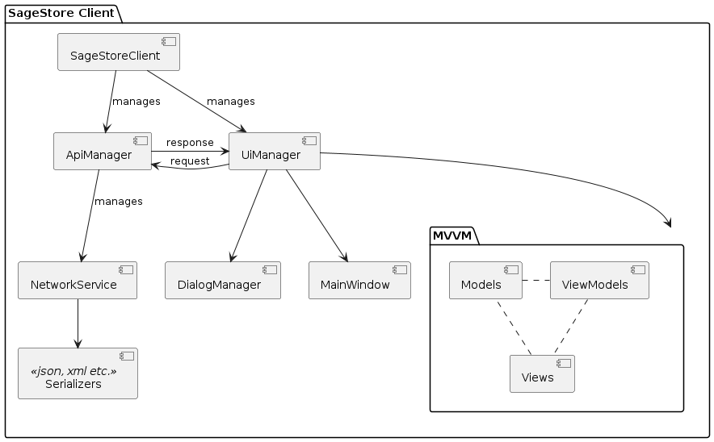
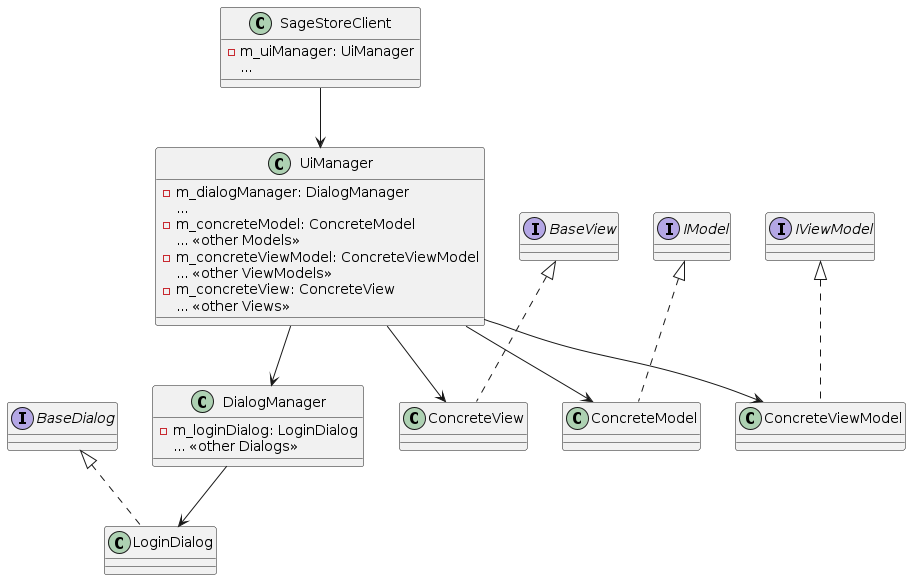
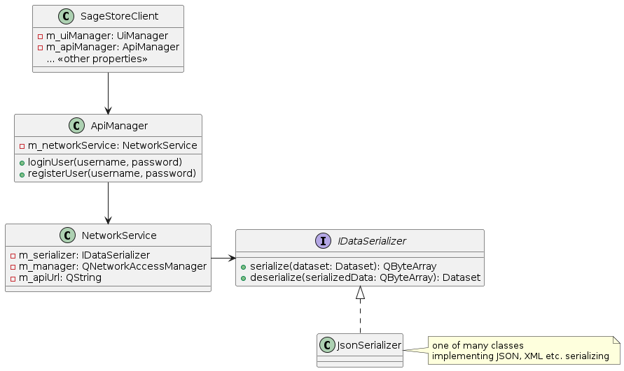

# SageStore

## Comprehensive Documentation for Design, Development, and Deployment Phases

- **Prepared by:** Volodymyr Pavlenko
- **Date:** February 20, 2024
- **Version:** 3.1

---

## Table of Contents

- [SageStore](#sagestore)
  - [Comprehensive Documentation for Design, Development, and Deployment Phases](#comprehensive-documentation-for-design-development-and-deployment-phases)
  - [Table of Contents](#table-of-contents)
  - [Project Overview](#project-overview)
  - [Project Time Borders](#project-time-borders)
  - [Project Objectives](#project-objectives)
  - [Timeline and Milestones](#timeline-and-milestones)
  - [Tech Stack](#tech-stack)
    - [Tools and Libraries](#tools-and-libraries)
  - [Feature Breakdown](#feature-breakdown)
  - [User Stories](#user-stories)
    - [User Stories for Administrator](#user-stories-for-administrator)
    - [User Stories for User](#user-stories-for-user)
  - [Database](#database)
    - [Table Name: Roles](#table-name-roles)
    - [Database schema](#database-schema)
  - [Architecture Design](#architecture-design)
    - [Client](#client)
      - [Client Design](#client-design)
      - [Component diagram](#component-diagram)
      - [Components](#components)
      - [MVVM Class Diagram](#mvvm-class-diagram)
      - [Networking Class Diagram](#networking-class-diagram)
      - [Relationships](#relationships)
    - [Server](#server)
      - [Server Design](#server-design)
      - [Overview](#overview)
      - [Architecture Layers and Components](#architecture-layers-and-components)
  - [Dataset specification](#dataset-specification)
    - [Components](#components-1)
    - [Entities](#entities)
      - [Result](#result)
      - [User](#user)
      - [Role](#role)
      - [PurchaseOrder](#purchaseorder)
      - [PurchaseOrderRecord](#purchaseorderrecord)
  - [REST API](#rest-api)
    - [Config](#config)
    - [Endpoints](#endpoints)
      - [Users](#users)
      - [Purchase](#purchase)
      - [Sales](#sales)
      - [Inventory](#inventory)
      - [Management](#management)
      - [Analytics](#analytics)
      - [Logs](#logs)
  - [Deployment Phase](#deployment-phase)
  - [Executive Summary](#executive-summary)
  - [Quality Assurance Plans](#quality-assurance-plans)
    - [Testing Phases](#testing-phases)
  - [Compliance and Regulations](#compliance-and-regulations)
  - [Document Versioning](#document-versioning)

---

## Project Overview

The ERP system aims to offer a comprehensive solution for managing the core business processes of a small-to-medium enterprise (SME). The system will be a client-server desktop application developed using C++20 and Qt 6.5.

---

## Project Time Borders

| Event         | Date            |
| ------------- | --------------- |
| Project Start | October 1, 2023 |
| Project End   | going on        |

---

## Project Objectives

| Objective                  | Description                                                |
| -------------------------- | ---------------------------------------------------------- |
| Efficient Sales Management | Handle different types of sales documentation efficiently. |
| Inventory Control          | Effective tracking and auditing of inventory.              |
| Scalable Analytics         | Analytics on sales, inventory, and employee performance.   |
| User-Friendly              | Intuitive UI and easy-to-use features.                     |

---

## Timeline and Milestones

| Milestone                                | Deadline         | Deliverable                                               | Sprint end (two weeks) |
| ---------------------------------------- | ---------------- | --------------------------------------------------------- | ---------------------- |
| Requirement Analysis and Planning        | October 18, 2023 | Detailed requirements and planning documents              | 2                      |
| Database Schema Design                   | October 20, 2023 | Database Schema and Entity-Relationship Diagrams          | 2                      |
| Tracebullet Project Version              | February 4, 2024 | Tracer implementation for login and registration features | 8                      |
| Frontend Development (Basic Features)    | April 28, 2024   | Completed UI for Basic Features                           | 12                     |
| Backend Development (Basic Features)     | May 7, 2024      | Working Backend for Basic Features                        | 13                     |
| Frontend Development (Advanced Features) | June 21, 2024    | Completed UI for Advanced Features                        | 16                     |
| Backend Development (Advanced Features)  | June 28, 2024    | Working Backend for Advanced Features                     | 17                     |
| Testing                                  | July 30, 2024    | Complete bug fixes                                        | 19                     |
| User Testing and Feedback                | July 31, 2024    | User feedback and final adjustments                       | 19                     |

---

## Tech Stack

### Tools and Libraries

| Category             | Tool/Library            | Reason/Notes                                                   |
| -------------------- | ----------------------- | -------------------------------------------------------------- |
| Programming Language | C++20                   | Modern C++ standard, good support for features and performance |
| GUI Framework        | Qt 6.5                  | Rich set of features, cross-platform support                   |
| Database             | SQLite                  | Lightweight, sufficient for small-to-medium projects           |
| Documentation        | Doxygen                 | Generate code documentation                                    |
| Profiling            | gprof, orbit            | To be decided based on performance needs                       |
| Data Serialization   | nlohmann/json           | Easy to use, well-maintained                                   |
| Concurrency          | Boost.Asio/QtConcurrent | Both are good options depending on specific needs              |
| Installer            | NSIS/Inno Setup         | Script-driven, customizable                                    |
| Dependency Manager   | Conan                   | Popular in C++, cross-platform support                         |
| Version Control      | Git/Gitlab              | Industry standard for source code management                   |
| IDE                  | Qt Creator/VS Code      | Qt Creator for GUI, VS Code for general coding (Optional)      |
| Communication        | Telegram                | For project updates, client communication                      |
| CI/CD                | Jenkins                 | Learning purpose, automating build and test processes          |

---

## Feature Breakdown

| **Module**     | **Submodule**            | **Functionality**                                     | **Additional Features**                                                                    |
| -------------- | ------------------------ | ----------------------------------------------------- | ------------------------------------------------------------------------------------------ |
| **Purchase**   | Barcodes                 | Create PDF for 2.5\*4                                 | Auto-generating for new ProductType. Creating label for custom size. Allow direct printing |
|                | Incoming invoices        | Create/View (Register received goods)                 | Attach to Purchase Order                                                                   |
|                | Upload invoices          | Upload CSV file                                       | Upload XML, XLSX etc. Custom functions                                                     |
| **Sale**       | Sale invoices            | Create/View Sale invoices                             | Edit/Delete, Search/Filter                                                                 |
|                | Export invoices          | Generate HTML/PDF for two types of invoices           | Allow direct Print, export to XML for Medoc etc.                                           |
| **Inventory**  | Product Types            | Add/View Product types                                | Edit/Delete, Search/Filter                                                                 |
|                | Supplier's products base | Upload from XML & CSV                                 | Create new ProductTypes from Incoming invoices                                             |
|                | Stock Tracking           | View all stock. Each Company has a it's own "storage" | Inventarization                                                                            |
| **Analytics**  | Sales Analytics          | Basic Sales Reports                                   | Advanced Filters, Time Range                                                               |
|                | Inventory Analytics      | Basic Stock Reports                                   | Advanced Filters, Time Range                                                               |
| **Users**      | Users                    | Create/View Users                                     | Edit/Delete, Search/Filter                                                                 |
|                | Users Roles              | Assign roles                                          | Create/Edit/Delete Roles                                                                   |
|                | User's History           | View logs                                             | Search/Filter                                                                              |
| **Management** | Employees                | Add/View Employees                                    | Edit/Delete, Search/Filter                                                                 |
|                | Suppliers                | Add/View Suppliers                                    | Edit/Delete, Search/Filter                                                                 |
|                | Contacts                 | Add/View Contacts                                     | Edit/Delete, Search/Filter                                                                 |
|                | Companies                | Add/View Company                                      | Edit/Delete, Search/Filter                                                                 |
|                | Contacts History         | View logs                                             | Search/Filter                                                                              |

## User Stories

### User Stories for Administrator

**Users Module**

- As an Administrator, I want to create new user profiles to manage system access.
- As an Administrator, I want to edit and delete user profiles other than my own to manage system access.
- As an Administrator, I want to assign roles to users to control their access levels.

### User Stories for User

**Purchase Module**

- As a User, I want to see list of all orders sorted by newer.
- As a User, I want to be able to open order by double-clicking on it.
- As a User, I want to see list of order records.
- As a User, I want to be able to add/edit/delete order's records.
- As a User, I want to be able to modify sellers and customers for concrete order.
- As a User, I want to see product description when I put a mouse on the product.
- As a User, I want to generate PDFs for 2.5\*4 barcodes so they can be printed and attached to products.
- As a User, I want to auto-generate barcodes for new Product Types to streamline the inventory process.

**Sale Module**

- As a User, I want to create, view, edit, and delete sale invoices to manage sales transactions.
- As a User, I want to export invoices to XML for Medoc to comply with external systems.

**Inventory Module**

- As a User, I want to add, view, edit, and delete Product Types to manage the inventory.
- As a User, I want to upload supplier product data from XML & CSV files to update the inventory.

**Analytics Module**

- As a User, I want to generate sales and stock reports with advanced filters and time ranges for detailed analysis.

**Users Module**

- As a User, I want to edit my own user profile to manage my personal information.

**Management Module**

- As a User, I want to add, view, edit, and delete employee, supplier, and customer profiles to manage relationships.
- As a User, I want to view customer and user activity logs to monitor system usage.

## Database

### Table Name: Roles

| Table Name           | Fields                                                                                               | Primary Key | Foreign Key               | Notes                                |
| -------------------- | ---------------------------------------------------------------------------------------------------- | ----------- | ------------------------- | ------------------------------------ |
| Roles                | id (int), name (string)                                                                              | id          | -                         | User roles for access control        |
| Users                | id (int), username (string), password (string), roleId (int)                                         | id          | roleId                    | User information                     |
| Logs                 | id (int), userId (int), action (string), timestamp (datetime)                                        | id          | userId                    | User logs                            |
| Contacts             | id (int), name (string), type (string), email (string), phone (string)                               | id          | -                         | Consolidates customers and suppliers |
| ContactInfo          | id (int), contactID (int), name (string), value (string)                                             | id          | contactID                 |
| Employees            | id (int), name (string), number (string), email (string), address (string)                           | id          | -                         | Employee details                     |
| Suppliers            | id (int), name (string), number (string), email (string), address (string)                           | id          | -                         | Supplier details                     |
| SuppliersProductInfo | id (int), supplierID (int), productTypeId (int), code (string)                                       | id          | supplierID                | Supplier info for product types      |
| ProductInfo          | id (int), productTypeId (int), name (string), value (string)                                         | id          | productTypeId             |
| ProductType          | id (int), code (string), barcode (string), ukt_zed (string), name (string), description (string),... | id          | -                         | Product type details                 |
| Inventory            | id (int), productTypeId (int), quantityAvailable (int), employeeId (int)                             | id          | productTypeId, employeeId | Current products inventory           |
| SaleOrders           | id (int), date (datetime), userId (int), contactId (int), employeeId (int), status (string),...      | id          | userId, contactId         | Manages sales orders                 |
| OrderInfo            | id (int), orderId (int), productTypeId (int), quantity (int), price (float)                          | id          | orderId, productTypeId    | Details of each order                |
| PurchaseOrders       | id (int), date (datetime), userId (int), supplierId (int), status (string),...                       | id          | userId, supplierId        | Manages purchase orders              |

### Database schema

## Architecture Design

### Client

#### Client Design

#### Component diagram

#### Components

- **SageStoreClient**: Serves as the entry point and orchestrator for the application. It initializes and runs the necessary components.
- **UiManager**: Manages the user interface elements, including their initialization and updates. This now includes new views like UserManagementView and RoleManagementView.

#### MVVM Class Diagram

**Layers:**

- **UI**: The core logic for managing UI interactions and Frontend logic (key elements are Dialogs and MVVM components)
- **DialogManager**: Manages all dialog windows, that appear in the application, like login dialog or messageboxes.
- **MVVM**: Model-View-ViewModel architecture for the widgets that will be used by user.

#### Networking Class Diagram

#### Relationships

- **SageStoreClient**: Manages ApiManager class.
- **ApiManager**: Implement API abstraction layer and send requests to server via NetworkService.
- **NetworkService**: Provides methods to send GET, POST etc. HTTP requests to server.
- **Serializers**: JSON, XML etc. serializers that could be set dynamically.

### Server

#### Server Design

#### Overview

The server architecture for the SageStore Management System aims to provide a robust, scalable, and maintainable backend for the system.

#### Architecture Layers and Components

**SageStoreServer**

- **Responsibilities**: Initializes the application, orchestrates the startup process.
- **Purpose**: Functions as the central control unit of the application.

**Network**

- **Responsibilities**: Acts as a gateway for the system, exposing RESTful APIs and RPC Endpoints to clients.
- **Purpose**: Implement async request-response using simple transaction model.

**BusinessLogic**

- **Responsibilities**: Implements the core business rules and functionalities of the system. It is structured into modules, with examples including UserRolesModule and LogsModule.
- **Purpose**: Enables a modular and extensible design that simplifies the addition, modification, or removal of functionalities.

**RepositoriesManager**
- **Responsibilities**: Provides access to the repositories.
- **Purpose**: Abstracts business logic from repositories lifetime management.

## Dataset specification

The `Dataset` structure in our application is designed to efficiently handle tabled data, particularly for communication over a network using formats like JSON or XML. The structure is defined as follows:

### Components

    - `Data`: Represents a single column of a table. It is a QStringList, where each QString is an individual cell value in the column.
    - `Dataset`: Represents the entire table. It is a QHash that maps a QString key to a Data object. The key is used to identify each column.

### Entities

Dataset is actually a `map<key, value>`, where `key is a string` and `value is a list of strings`

Dataset could store data `entities`. All possible entities are described below. 

It's important to know that Dataset could store any array of one entity, because `value` is actually an array.

If some key is not specified, it has `{ "" }` value as a placeholder for the list of strings.

#### Result

If error key exists, it mean that error occured (even if message is empty).

| Key   | Value  |
| ----- | ------ |
| error | { "error description" } |

#### User
| Key      | Value            |
| -------- | ---------------- |
| id       | { "0" }          |
| username | { "MyLogin" }    |
| password | { "MyPassword" } |
| roleId   | { "0" }          |

#### Role
| Key  | Value               |
| ---- | ------------------- |
| id   | { "0" }             |
| name | { "Administrator" } |

#### PurchaseOrder
| Key         | Value                     |
| ----------- | ------------------------- |
| id          | { "0" }                   |
| date        | { "YYYY-MM-DD HH:MM:SS" } |
| user_id     | { "1" }                   |
| supplier_id | { "2" }                   |
| status      | { "READY" }               |

#### PurchaseOrderRecord
| Key         | Value                               |
| ----------- | ----------------------------------- |
| id          | { "0" }                             |
| orderId     | { "0" }                             |
| code        | { "123123" }                        |
| name        | { "Product1" }                      |
| quantity    | { "1" }                             |
| unit        | { "шт." }                           |
| price       | { "123.10" }                        |
| barcode     | { "123123" }                        |
| description | { "Some long product description" } |
| isImported  | { "True" }                          |

## REST API

Below you could find spesification for different RESTful API request-response. 

### Config

| Method | URL                            | Description                            |
| ------ | ------------------------------ | -------------------------------------- |
| `GET`  | `http://localhost:8000/config` | Fetch recommended client configuration |

Current configuration structure:

| Field               | Value                       |
| ------------------- | --------------------------- |
| `apiUrl`            | `http://localhost:8000/api` |
| `serializationType` | `json`, `xml`               |

Before you start to use next API Endpoints you should to remember that REST API url starts with `/api` endpoint
For example `http://localhost:8000/api/sales`

### Endpoints

Request or Response are one of entities described above. 

Important: `User[username, password]` - data specified in `[]` tell about important keys, that must be present. It means that else keys are optional.

As for the cases of simple entity name `User`, it just means that all keys must be presented and be valid.

About arrays: Request or Response is array of entities if it's specified as `array<User>`

#### Users

| Method   | Endpoint                | Request                  | Response         | Description                           |
| -------- | ----------------------- | ------------------------ | ---------------- | ------------------------------------- |
| `POST`   | `/users/login`          | User[username, password] | User[id, roleId] | Authenticate a user                   |
| `POST`   | `/users/register`       | User[username, password] | Result           | Register a new user                   |
| `GET`    | `/users/roles`          | -                        | array<Role>      | Fetch all roles for Role-based access |
| `POST`   | `/users/roles`          | Role                     | Result           | Add a new role (Admin only)           |
| `PUT`    | `/users/roles/{roleId}` | Role                     | Result           | Edit a specific role (Admin only)     |
| `DELETE` | `/users/roles/{roleId}` | -                        | Result           | Delete a specific role (Admin only)   |

#### Purchase

| Method   | Endpoint                       | Request             | Response                   | Description                       |
| -------- | ------------------------------ | ------------------- | -------------------------- | --------------------------------- |
| `GET`    | `/purchase`                    | -                   | array<PurchaseOrder>       | Fetch all purchases records       |
| `POST`   | `/purchase`                    | PurchaseOrder       | Result                     | Add a new purchase                |
| `PUT`    | `/purchase/{purchaseId}`       | PurchaseOrder       | Result                     | Edit a specific purchase          |
| `DELETE` | `/purchase/{purchaseId}`       | -                   | Result                     | Delete a specific purchase        |
| `GET`    | `/purchase_order/{purchaseId}` | PurchaseOrderRecord | array<PurchaseOrderRecord> | Fetch the list of order's records |
| `POST`   | `/purchase_order/{purchaseId}` | -                   | Result                     | Add new record to list            |
| `PUT`    | `/purchase_order/{purchaseId}` | PurchaseOrderRecord | Result                     | Edit a specific record            |
| `DELETE` | `/purchase_order/{purchaseId}` | -                   | Result                     | Delete a specific record          |

#### Sales

| Method   | Endpoint          | Request | Response         | Description             |
| -------- | ----------------- | ------- | ---------------- | ----------------------- |
| `GET`    | `/sales`          | -       | Dataset          | Fetch all sales records |
| `POST`   | `/sales`          | Dataset | New sale's id    | Add a new sale          |
| `PUT`    | `/sales/{saleId}` | Dataset | Edited sale's id | Edit a specific sale    |
| `DELETE` | `/sales/{saleId}` | -       | Result           | Delete a specific sale  |

#### Inventory

| Method   | Endpoint              | Request        | Response         | Description                      |
| -------- | --------------------- | -------------- | ---------------- | -------------------------------- |
| `GET`    | `/inventory`          | -              | Inventory list   | Fetch all inventory items        |
| `POST`   | `/inventory`          | Inventory item | New item's id    | Add new inventory items          |
| `PUT`    | `/inventory/{itemId}` | Inventory item | Edited item's id | Edit a specific inventory item   |
| `DELETE` | `/inventory/{itemId}` | -              | Result           | Delete a specific inventory item |

#### Management

| Method   | Endpoint                     | Request       | Response             | Description                             |
| -------- | ---------------------------- | ------------- | -------------------- | --------------------------------------- |
| `GET`    | `/management/employees`      | -             | Employees list       | Fetch all employees                     |
| `POST`   | `/management/employees`      | Employee data | New employee's id    | Add a new employee (Admin only)         |
| `PUT`    | `/management/employees/{id}` | Employee data | Edited employee's id | Edit a specific employee (Admin only)   |
| `DELETE` | `/management/employees/{id}` | -             | Result               | Delete a specific employee (Admin only) |
| `GET`    | `/management/clients`        | -             | Clients list         | Fetch all clients                       |
| `POST`   | `/management/clients`        | Client data   | New client's id      | Add a new client                        |
| `PUT`    | `/management/clients/{id}`   | Client data   | Edited client's id   | Edit a specific client                  |
| `DELETE` | `/management/clients/{id}`   | -             | Result               | Delete a specific client                |
| `GET`    | `/management/suppliers`      | -             | Suppliers list       | Fetch all suppliers                     |
| `POST`   | `/management/suppliers`      | Supplier data | New supplier's id    | Add a new supplier                      |
| `PUT`    | `/management/suppliers/{id}` | Supplier data | Edited supplier's id | Edit a specific supplier                |
| `DELETE` | `/management/suppliers/{id}` | -             | Result               | Delete a specific supplier              |
| `GET`    | `/management/companies`      | -             | Companies list       | Fetch all companies                     |
| `POST`   | `/management/companies`      | Company data  | New company's id     | Add a new company                       |
| `PUT`    | `/management/companies/{id}` | Company data  | Edited company's id  | Edit a specific company                 |
| `DELETE` | `/management/companies/{id}` | -             | Result               | Delete a specific company               |

#### Analytics

| Method | Endpoint               | Request | Response                 | Description               |
| ------ | ---------------------- | ------- | ------------------------ | ------------------------- |
| `GET`  | `/analytics/sales`     | -       | Sales analytics data     | Fetch Sales Analytics     |
| `GET`  | `/analytics/inventory` | -       | Inventory analytics data | Fetch Inventory Analytics |

#### Logs

| Method   | Endpoint        | Request  | Response        | Description           |
| -------- | --------------- | -------- | --------------- | --------------------- |
| `GET`    | `/logs`         | -        | Logs list       | Fetch all logs        |
| `POST`   | `/logs`         | Log data | New log's id    | Add a new log         |
| `PUT`    | `/logs/{logId}` | Log data | Edited log's id | Edit a specific log   |
| `DELETE` | `/logs/{logId}` | -        | Result          | Delete a specific log |

## Deployment Phase

Still in development

## Executive Summary

The aim of this project is to develop a comprehensive software solution for small Enterprises, that are specialized on selling goods (like shops).

## Quality Assurance Plans

### Testing Phases

- Unit Testing

## Compliance and Regulations

- Data Protection: All features will comply with GDPR and other relevant data protection laws.

## Document Versioning

| Date       | Version | Description                                                       | Author             |
| ---------- | ------- | ----------------------------------------------------------------- | ------------------ |
| 01/10/2023 | 1.0     | Initial Draft                                                     | Pavlenko Volodymyr |
| 04/10/2023 | 1.1     | Changed milestones. Features breakdown. Database and architecture | Pavlenko Volodymyr |
| 08/10/2023 | 1.2     | Changed WBS to Sprint Planning Table. Added team table            | Pavlenko Volodymyr |
| 09/10/2023 | 1.3     | Created Client and Server base Architectural Designs              | Pavlenko Volodymyr |
| 09/10/2023 | 1.4     | Created REST API design. Updated Server schema                    | Pavlenko Volodymyr |
| 10/10/2023 | 2.0     | Full docs revision. Refactored schemas                            | Pavlenko Volodymyr |
| 04/02/2024 | 3.0     | Full-ranged docs rev. Complete schemas and design refactoring     | Pavlenko Volodymyr |
| 20/02/2024 | 3.1     | REST revision. Finishing docs structure                           | Pavlenko Volodymyr |
| 20/02/2024 | 3.2     | Add Purchase spesific docs                                        | Pavlenko Volodymyr |
