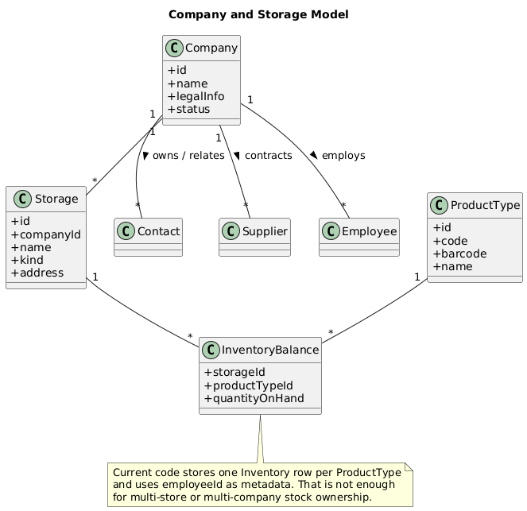
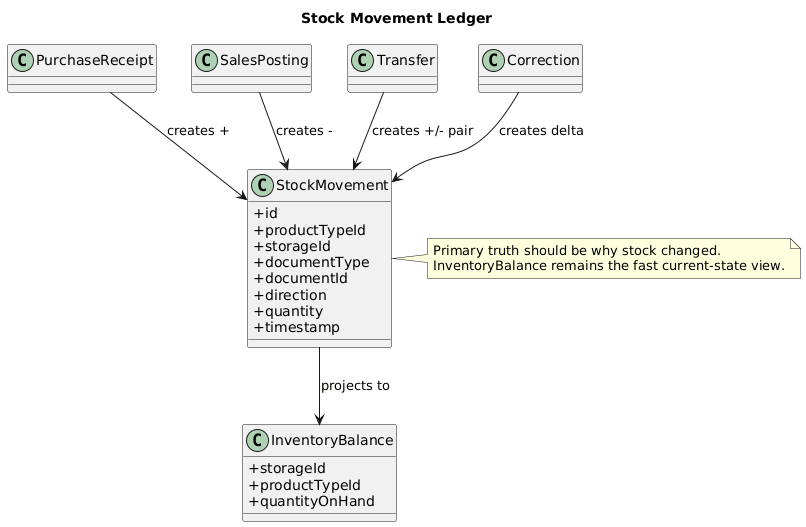
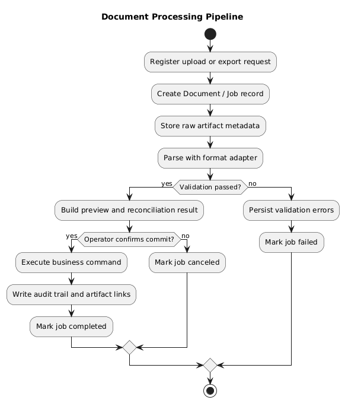
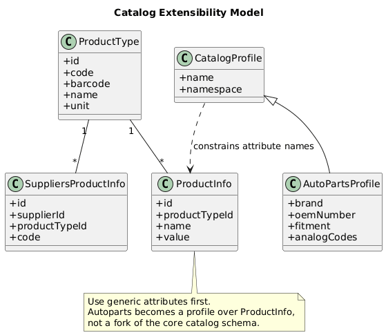
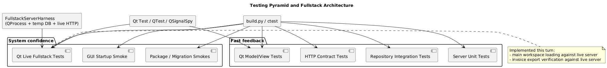
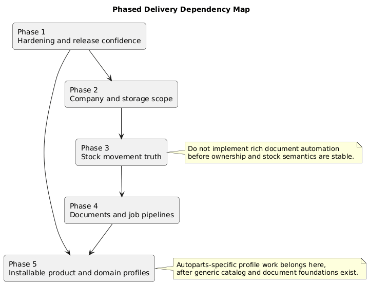

# SageStore ERP Readiness Gap Design

## Purpose

This document explains why SageStore is still an ERP MVP rather than an installable,
ERP-complete product, using the current repository as evidence. It also defines the
target design for the missing areas, the dependency order to implement them safely,
and the testing architecture required to ship the system with confidence.

This page complements:

- `docs/Implementation_Status.md` for current implementation truth
- `docs/Requirements_Baseline.md` for current-vs-target reconciliation
- `docs/Future_Architecture_and_Design_Roadmap.md` for forward phase planning

## Executive Summary

SageStore is already a real desktop-first, API-backed ERP baseline. The codebase has
implemented users, inventory, management, purchase, sales, logs, analytics, contract
tests, repository tests, and Qt widget tests across `_client/`, `_server/`, and
`_common/`.

It is not yet ERP-ready or install-ready for three reasons:

1. The data model still lacks business ownership scope:
   `Company`, `Storage`, and stock-movement semantics do not exist yet.
2. Document-processing workflows are still shallow:
   incoming invoices, attachments, richer exports, labels, jobs, and packaging are
   absent.
3. Validation depth is improving but still incomplete:
   the repository now has live client+server Qt workflow coverage for inventory CRUD,
   management contact creation, purchase receipt posting, sales invoice preview/export,
   and broad workspace loading, but broader auth/admin/fulfillment paths still need the
   same depth.

For an autoparts store, the right strategy is to keep the core product model generic
and use generic product attributes plus external supplier codes for specialization,
rather than baking autoparts-only entities into the core too early.

## Current Code-Evidenced Gaps

| Gap | Current repo evidence | Why it blocks ERP readiness | Target design |
| --- | --- | --- | --- |
| Company and storage ownership | `scripts/create_db.sql` has no `Company` or `Storage`; `Inventory` is `UNIQUE(productTypeId)` and only stores `employeeId`; `_server/src/BusinessLogic/ManagementModule.cpp` only serves `contacts`, `suppliers`, and `employees` | The system cannot explain whose stock exists, where stock lives, or how multi-store operation should work | Add `Company`, `Storage`, and ownership/scope rules before broadening procurement and sales |
| Stock movement truth | `_server/src/BusinessLogic/PurchaseModule.cpp` posts receipts into `Inventory`; `_server/src/BusinessLogic/SalesModule.cpp` does CRUD only and never touches inventory | Inventory quantity changes are not explained by a ledger, and sales stock effects are unresolved | Introduce stock movements plus a projection model instead of editing balances as the primary source of truth |
| Incoming invoices and attachments | `PurchaseModule` exposes `orders`, `order-records`, and `receipts`; no attachment entities, endpoints, or repositories exist | Procurement is not evidence-backed; uploads, previews, and audit trails for supplier documents do not exist | Add a document/attachment module plus staged invoice processing |
| Import/export pipelines and jobs | `_client/src/Ui/Views/SupplierCatalogView.cpp` imports CSV directly; `_client/src/Ui/Views/SalesView.cpp` exports a text file directly; there is no job table or job API | Long-running or failure-prone document flows are not resumable, auditable, or observable | Split file adapters from domain commit logic and run them through parse/validate/preview/commit pipelines |
| Generic catalog extensibility | `ProductType` has core fields, `SuppliersProductInfo` maps supplier codes, and `ProductInfoRepository` exists, but `ProductInfo` is not wired into repository-manager/business/API/UI flows | The platform is not ready for deep domain specialization such as autoparts fitment, OEM codes, or alternate catalog profiles without schema churn | Use generic attribute and external-code modeling first, then layer optional domain profiles on top |
| Installability and operability | `README.md` explicitly says the product is not yet a packaged production release; `/api/system/health` now exists, but there are still no installer flows, migration runner, or backup/restore path | A working codebase is not yet an installable product with predictable deployment, backup, and upgrade behavior | Add package profiles, migration discipline, readiness checks, and operator runbooks |
| System-level validation depth | The repo now has live Qt fullstack tests for inventory CRUD, workspace loading, management contact creation, purchase receipt posting, and sales invoice preview/export, but major auth/admin/fulfillment paths are still missing | Release confidence is still lower than the implemented surface area | Keep Qt Test as the primary UI automation tool and expand live-system coverage by workflow |

## Per-Gap Design Direction

### 1. Company and Storage Model

- Add `Company` as a business owner, not as a cosmetic label.
- Add `Storage` as the operational stock container linked to a company.
- Clarify which master data is global versus scoped:
  - `ProductType` stays global
  - `Supplier` and `Contact` may be global with company relationships
  - `Inventory` becomes a projection per `storageId + productTypeId`
- Do not overload `Employee` as stock ownership metadata.

### 2. Stock Movement Ledger

- Keep `Inventory` as a projection or current balance view.
- Record stock changes as explicit movements:
  - purchase receipt
  - sales posting
  - transfer
  - correction
  - return
- Move invariants into server workflow services so the UI never invents stock state.

### 3. Documents, Attachments, and Ingestion

- Introduce a `documents` or `attachments` module for binary/file metadata.
- Keep files out of core transactional entities where possible.
- Model invoice handling as a staged workflow:
  - upload/register
  - parse
  - validate
  - preview differences
  - commit/post
  - audit and retain artifacts

### 4. Imports, Exports, and Background Jobs

- Isolate format adapters from business commands.
- Add a generic job status model for:
  - supplier catalog imports
  - incoming invoice processing
  - large export generation
  - barcode/label generation
- Design every job for idempotency, preview, traceability, and retry.

### 5. Product Catalog Extensibility for Autoparts and Generic Stores

- Keep the core catalog generic:
  - `ProductType` remains the canonical sellable/master entity
  - `SuppliersProductInfo` remains the supplier-facing code bridge
  - `ProductInfo` becomes the generic typed attribute surface
- For autoparts specifically, represent OEM numbers, brand, vehicle fitment, analogs,
  and dimensions as namespaced attribute sets instead of introducing autoparts-only
  tables prematurely.
- That keeps the platform usable for non-autoparts stores while still supporting an
  autoparts profile.

### 6. Installability and Operability

- Define one supported packaged release path first, not many.
- Add:
  - installer/build profile
  - config defaults and override rules
  - readiness/health endpoint or startup validation command
  - backup/restore and migration runbooks
- Treat packaging as part of product quality, not post-processing.

### 7. Testing Architecture

- Keep the current layered model:
  - server unit tests
  - repository integration tests
  - HTTP contract tests
  - Qt model/view unit tests
- Expand it with live GUI component tests using Qt Test and a shared `QProcess`-managed
  server harness instead of bringing in a second UI automation framework too early.
- This turn adds:
  - `/api/system/health` for neutral readiness checks and harness startup
  - `FullstackInventoryWorkflowTest`
  - `FullstackMainWindowWorkflowTest`
  - `FullstackWorkflowTest`
  - `FullstackSalesInvoiceExportTest`

## Phased Delivery Plan

### Phase 1: Baseline hardening and release confidence

- Keep the current live GUI workflow suite green
- Expand live GUI coverage from load/preview/receipt slices into auth failure, admin CRUD,
  purchase editing, and sales posting/cancel flows
- Keep invoice export verification green
- Fix packaging direction, runbooks, and readiness checks
- Close test/build infrastructure gaps so `python3 build.py tests` and docs flow stay reliable

### Phase 2: Ownership and inventory scope

- Implement `Company` and `Storage`
- Define scope rules for contacts, suppliers, and employees
- Replace single-balance inventory semantics with company/storage-aware projections

### Phase 3: Stock-truth workflows

- Introduce stock movements
- Decide and implement sales reservation/posting policy
- Add transfer/correction/return semantics

### Phase 4: Documents and job pipelines

- Implement attachments/documents
- Add incoming invoice registration and staging
- Add background jobs and operator-visible job history
- Add barcode/label generation after identifiers and storage rules are stable

### Phase 5: Installable product and domain profiles

- Ship one supported installer/package path
- Add backup/restore/migration discipline
- Stabilize generic product attributes and optional domain profiles
- Add autoparts-specific attribute packs and report/export templates without polluting the core schema

## Testing Strategy

| Layer | Purpose | Current state | Required next step |
| --- | --- | --- | --- |
| Server unit tests | business invariants and repository orchestration | present | keep extending around new workflows and new stock rules |
| Repository integration | SQLite round-trip and FK behavior | present | add migration and multi-scope inventory scenarios |
| HTTP contract tests | endpoint datasets and error handling | present | expand to new modules and attachment/job APIs |
| Qt model/view tests | UI behavior with mock API | present | keep fast feedback for view logic and dialogs |
| Live GUI component tests | real client UI against live server | present via Qt Test fullstack harness for inventory CRUD, workspace loading, management contact creation, purchase receipt posting, and sales invoice preview/export | expand into auth/admin CRUD, richer management flows, and sales posting/cancel flows |
| Release smoke tests | real packaged-runtime startup and critical workflows | startup/API smoke present | add packaged install smoke and migration smoke |

## Implemented in This Turn

- Added a real fullstack Qt GUI harness using a temporary live server process.
- Added `/api/system/health` so the harness and deployment checks can use a neutral
  readiness probe instead of inventory data.
- Added `FullstackInventoryWorkflowTest` to verify real login plus inventory CRUD.
- Added `FullstackMainWindowWorkflowTest` to verify the main implemented workspaces load
  real data from the server.
- Added `FullstackWorkflowTest` to verify management contact creation, purchase receipt
  posting, and sales invoice preview against the live backend.
- Added `FullstackSalesInvoiceExportTest` to verify invoice export file contents against
  the live backend.
- Added a minimal `SalesView` export-path seam so file export can be validated without
  changing user behavior.

## Diagram Set

- [ERP readiness gap map](ERP_Readiness_Gap_Map.png)
- [Company and storage model](Company_Storage_Model.png)
- [Stock movement ledger](Stock_Movement_Ledger.png)
- [Document processing pipeline](Document_Processing_Pipeline.png)
- [Catalog extensibility model](Catalog_Extensibility_Model.png)
- [Testing pyramid and fullstack architecture](Testing_Pyramid_and_Fullstack.png)
- [Phased delivery dependency map](Phased_Delivery_Dependency_Map.png)
